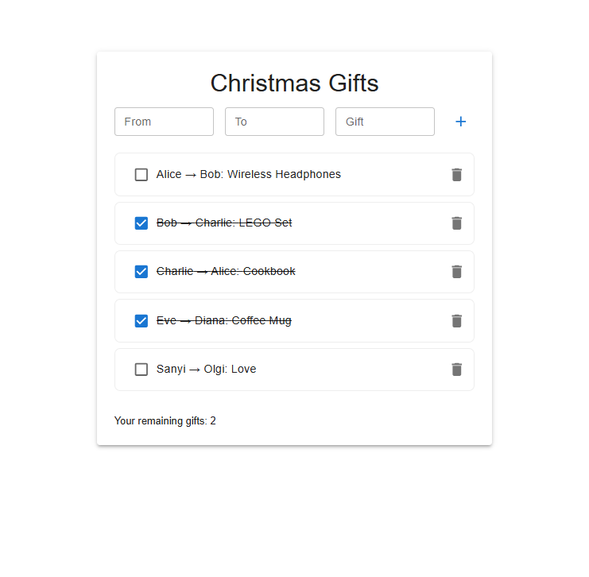

# Favorite Data Editor

A simple full-stack app to manage Christmas gifts using React and Express.

## Preview



## Features

- View, add, and delete gifts
- Responsive and modern user interface
- Simple gift management for Christmas

## Tech Stack

<div align="center">
   
   
   
   
   
</div>

- **React (Vite)**
- **Material UI**
- **Express (Node.js)**
- **Framer Motion** (for interactive animations)

## Getting Started

1. Install dependencies:
   ```
   npm install
   ```
2. Start the Express server:
   ```
   npm start
   ```
3. Start the React frontend:
   ```
   npm run dev
   ```

## Data Storage & Limitations

**Note:** This project uses a local JSON file (`server/data.json`) for data storage. It is not for production or multi-user environments.

## Future Plans

I’d like to make this project even better in the future! Some ideas include:

- Making it possible to log in and share your gift list with friends or family
- Allowing you to edit gifts after adding them
- Saving your data securely online so you can access it from anywhere
- Improving the look and feel with more design options
- Making sure everything works smoothly and reliably
