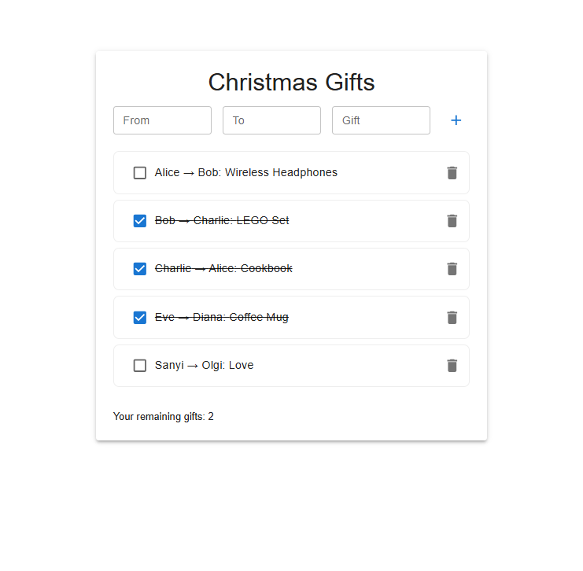

# Favorite Data Editor

[![React][React-badge]][React-url] [![Vite][Vite-badge]][Vite-url] [![JavaScript][JS-badge]][JS-url] [![Node][Node-badge]][Node-url] [![Express][Express-badge]][Express-url] [![Material UI][MaterialUI-badge]][MaterialUI-url] [![CSS3][CSS3-badge]][CSS3-url]


A simple full-stack app to manage Christmas gifts using React and Express.

## Preview



## Features

- View, add, and delete gifts
- Responsive and modern user interface
- Simple gift management for Christmas

## Tech Stack

**Frontend:**

- React 19 with Vite
- Material UI (MUI)
- Framer Motion (for interactive animations)
- CSS3 & Emotion

**Backend:**

- Node.js with Express
- JSON file-based data storage

## Getting Started

1. Install dependencies:
   ```
   npm install
   ```
2. Start the Express server:
   ```
   npm start
   ```
3. Start the React frontend:
   ```
   npm run dev
   ```

## Data Storage & Limitations

**Note:** This project uses a local JSON file (`server/data.json`) for data storage. It is not for production or multi-user environments.

## Future Plans

I’d like to make this project even better in the future! Some ideas include:

- Making it possible to log in and share your gift list with friends or family
- Allowing you to edit gifts after adding them
- Saving your data securely online so you can access it from anywhere
- Improving the look and feel with more design options
- Making sure everything works smoothly and reliably

<!-- BADGES & URLS -->

[React-badge]: https://img.shields.io/badge/React_19-61DAFB?style=for-the-badge&logo=react&logoColor=black
[React-url]: https://react.dev/
[Vite-badge]: https://img.shields.io/badge/Vite-646CFF?style=for-the-badge&logo=vite&logoColor=white
[Vite-url]: https://vite.dev/
[JS-badge]: https://img.shields.io/badge/JavaScript-F7DF1E?style=for-the-badge&logo=javascript&logoColor=black
[JS-url]: https://developer.mozilla.org/en-US/docs/Web/JavaScript
[Node-badge]: https://img.shields.io/badge/Node.js-339933?style=for-the-badge&logo=node.js&logoColor=white
[Node-url]: https://nodejs.org/
[Express-badge]: https://img.shields.io/badge/Express-000000?style=for-the-badge&logo=express&logoColor=white
[Express-url]: https://expressjs.com/
[MaterialUI-badge]: https://img.shields.io/badge/Material_UI-007FFF?style=for-the-badge&logo=mui&logoColor=white
[MaterialUI-url]: https://mui.com/
[CSS3-badge]: https://img.shields.io/badge/CSS3-1572B6?style=for-the-badge&logo=css3&logoColor=white
[CSS3-url]: https://developer.mozilla.org/en-US/docs/Web/CSS

